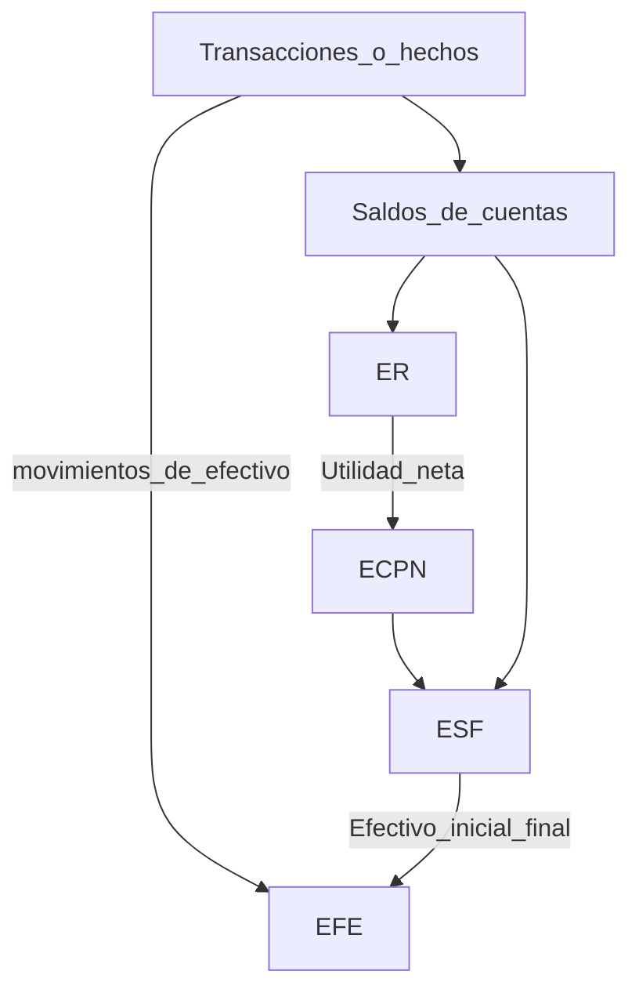
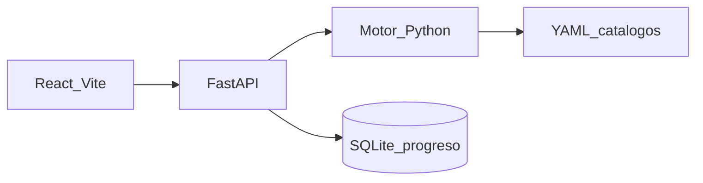

# PLAN DE IMPLEMENTACIÓN — App educativa Fundamentos de Contabilidad

**Curso:** Fundamentos de Contabilidad (160092) · UP · 2026-2  
**Principio:** runtime sin LLM; motor determinístico; materiales = fuente de verdad académica.  
**Documentos hermanos:** [`INVENTARIO_MATERIALES.md`](INVENTARIO_MATERIALES.md) · [`DECISIONES_ARQUITECTURA.md`](DECISIONES_ARQUITECTURA.md)

**Convención de evidencia:** `[R]` respaldado · `[I]` inferido · `[P]` propuesta de diseño.

---

## 1. Resumen ejecutivo

Se propone construir una aplicación **localhost** para enseñar las Unidades 1–4 del curso: **ESF, ER, ECPN y EFE**, con núcleo en la **ecuación contable** y proyecciones a estados financieros.

El plan original de “cuatro paneles vivos + simulación libre” se **acepta solo como fase tardía**. Los materiales muestran semanas de práctica aislada (sobre todo ESF) antes de la integración (PD4, Park City, PC2 en cronograma).

**MVP recomendado:** catálogo de cuentas + motor de ecuación + proyecciones ESF/ER/ECPN/EFE + ejercicios guiados/comprobar, validados con solucionarios golden. UI React + API FastAPI + motor Python. Sin diario/mayor hasta tener materiales de Unidades 5+.

---

## 2. Inventario de materiales

Ver detalle completo en [`INVENTARIO_MATERIALES.md`](INVENTARIO_MATERIALES.md).

| Ubicación | Contenido |
|-----------|-----------|
| `OneDrive_2026-09-11.zip` + carpeta homónima | Corpus original (no modificar) |
| Semanas 1–2 | Ecuación + ESF |
| Semanas 3–4 | ER, ECPN, EFE, 4 EEFF |
| PDs 1–4 + PC1 | Evaluaciones + solucionarios |
| Sílabo/cronograma | Secuencia y alcance del curso completo |

**Brecha:** el sílabo llega a ciclo contable, ratios y costos; **esta carpeta no incluye** esos paquetes de práctica.

**Presentaciones 1–4 (`.ppt`):** inspeccionadas en esta entrega (extracción COM); hallazgos incorporados al inventario y a la decisión D16 (sistema periódico, plantilla ESF, EFE directo/indirecto nombrados, etc.).

---

## 3. Qué aporta cada archivo

Resumen por utilidad al motor (detalle en inventario):

| Utilidad | Archivos clave |
|----------|----------------|
| Nombres y secuencia pedagógica | Sílabo 160092, Cronograma 26-2 |
| Catálogo ESF | Presentación 2, PDF cuentas, PPTX análisis |
| Reglas de cálculo (dep, RL, adelantados) | PPTX análisis ESF, PD2 |
| Estructura ER/CV periódico | Presentación 3, Ejemplo ER, PPTX detalle ER |
| EFE directo AO/AI/AF | Presentación 4, PD3 E3, PD4, Las Vegas, Park City |
| ECPN | PD3 E2, Valparaíso, Park City |
| Tests golden | Todos los `solucionario` / `solejercicio` / PC1 / PD1–4 |
| Pedagogía de hints | Metodología PD2 (JP) |

---

## 4. Modelo del conocimiento encontrado

### 4.1 Entidades `[R]`

- Empresa / período / fecha de corte  
- Cuenta (nombre, elemento, macroclase, signo natural, contra-cuenta?)  
- Saldo de cuenta  
- Transacción / hecho económico  
- Estado financiero (plantilla + líneas)  
- Parámetros: tasa IR, % reserva legal, tope reserva, vidas útiles, valores de rescate  

### 4.2 Elementos y macroclases `[R]`

- Elementos: Activo, Pasivo, Patrimonio Neto, Ingreso, Gasto  
- ESF: AC, ANC, PC, PNC, PN  
- Subórdenes AC: disponible, exigible, realizable (Presentación 2)  
- EFE: Actividades de Operación, Inversión, Financiamiento  

### 4.3 Fórmulas recurrentes `[R]`

| Fórmula | Uso |
|---------|-----|
| Activo = Pasivo + Patrimonio Neto | Identidad ESF / ecuación |
| Depreciación período = (Costo − Valor rescate) / vida × fracción período | Activos tangibles (terreno no se deprecia) |
| Amortización = Costo / plazo (sin rescate) | Intangibles |
| CV = II + Compras netas − IF (ajustes por robo según enunciado) | Sistema **periódico** |
| Compras netas = Compras + fletes/seguros − devoluciones/rebajas | ER |
| Ventas netas = Ventas brutas − devoluciones/rebajas − dscto pronto pago otorgado | ER |
| UAIR → IR = UAIR × 29.5% → UN | Cierre |
| Δ Reserva legal = min(10%×UN, tope 20%×Capital − RL actual) | ECPN / ESF |
| EFE: Σ AO + Σ AI + Σ AF + Efectivo inicial = Efectivo final | Reconciliación |

### 4.4 Restricciones / excepciones vistas `[R]`

- Terreno no se deprecia.  
- Sobregiro: efectivo negativo → pasivo (antes de tributos).  
- Aporte en activos fijos: afecta ESF/ECPN, **no** es flujo de efectivo (PD4).  
- Dividendos declarados no pagados: ECPN/pasivo; no salida en EFE hasta pago.  
- Intereses: gasto en ER; pago en EFE (clasificación según enunciado; en Las Vegas van en AF en el solucionario — **no generalizar sin más evidencia** `[I]`).  
- Robo de mercadería: afecta inventario/CV o partida operativa según solución del caso.  

### 4.5 Lo que NO debe entrar solo por “contabilidad general”

Cualquier regla no citada arriba debe etiquetarse `[I]` o `[P]` y exigir segundo ejercicio o texto teórico antes de codificarse como general.

---

## 5. Cómo se relacionan los estados según los materiales



| Puente | Evidencia `[R]` |
|--------|-----------------|
| UN del ER entra a Resultados acumulados / ECPN | Park City, PD3, Valparaíso |
| Movimientos patrimoniales (aportes, dividendos, reservas, capitalización) | PD3 E2, PD4, Park City |
| Efectivo ESF ↔ EFE | PD3 E3, PD4 E1, Las Vegas |
| Depreciación: gasto ER + ↑ dep. acum. ESF; sin cash out | Solucionarios ESF/ER vs EFE |
| Una venta: ↑ CxC/Efectivo + ingreso; y ↓ Mercadería + CV | Ecuación Ej.2; PPTX detalle ER |

**Conclusión pedagógica:** hay **suficiente** evidencia de conexiones para enseñar integración, pero el curso la introduce **después** del dominio aislado. La UI integrada debe reflejar esa secuencia.

---

## 6. Modelo pedagógico propuesto

### 6.1 Modelo actual del curso (`MODELO_PEDAGOGICO_ACTUAL_DEL_CURSO`) `[R]`

1. Conceptos + ecuación + partida doble (Presentación 1).  
2. Catálogo y armado ESF (Presentación 2, Semanas 1–2, PD1–2, PC1).  
3. ER y ECPN (Semana 4 teórica, PD3).  
4. EFE e integración (Semana 5, PD4, ejercicios Park City/Las Vegas; PC2).  
5. Recién después: diario/mayor (fuera de materiales actuales).  

Método de resolución dominante temprano: **matriz de ecuación contable**, no asientos formales.

Errores que el curso entrená: mal elemento; mal CP/LP; omitir CV; confundir devengado vs caja; depreciar terreno; ignorar tope RL; mal clasificar en EFE; olvidar prorrateos.

### 6.2 Niveles revisados `[P]`

| Nivel | Nombre | ¿Útil? | Notas |
|-------|--------|--------|-------|
| 1 | Reconocimiento / clasificación | Sí | PD1 Ej.1 |
| 2 | Ecuación / efecto de transacciones | Sí | Fusiona “construcción” + “efecto” tempranos |
| 3 | Construcción ESF | Sí | Incluye orden y contra-cuentas |
| 4 | Cálculo / cierres (IR, RL, dep) | Sí | Antes de multiestado |
| 5 | ER / ECPN / EFE aislados | Sí | PD3 |
| 6 | Integración guiada entre estados | Sí | Park City / PD4; **aquí** aparece vista multiestado |
| 7 | Práctica sin ayuda + comprobar | Sí | Estilo PC |
| 8 | Simulación restringida / inverso | Opcional tardío | No libre total |

**Descartado/pospuesto del plan original:** simulación libre de celdas; razonamiento inverso como núcleo; grafos.

---

## 7. Crítica al plan original

| Pregunta | Respuesta |
|----------|-----------|
| ¿La interfaz integrada de 4 estados ayuda? | **Sí, pero tarde.** Ayuda a PC2/integración; confunde en Semanas 1–2. |
| ¿Cuándo debe aparecer? | Tras dominar niveles 1–5; alineado a PD4/Park City. |
| ¿Demasiado complejo para principiante? | **Sí** si es la puerta de entrada. |
| ¿Hay suficientes conexiones en materiales? | **Sí** (Park City, Las Vegas, PD4, PPTX dual ESF+ER). |
| ¿Aislado primero luego integrar? | **Sí** — es exactamente el cronograma. |
| ¿“Modificar un dato y ver efectos” representa los ejercicios? | **Parcialmente no.** Los ejercicios parten de **transacciones/hechos**, no de editar totales. Mejor: aplicar operación tipada → recalcular. |
| ¿Qué olvidamos? | Encabezados formales; orden de liquidez/exigibilidad; sistema periódico; sobregiro; no monetarias; redondeos; guías de JP. |
| ¿Qué es innecesario al inicio? | Vista 2×2 animada; ML; grafos; auth multiusuario; método indirecto EFE. |
| ¿Qué está equivocado? | Tratar los 4 EEFF como mundos editables independientes. |
| ¿Qué posponer? | Modos C/D libres; Unidad 5+; adaptación fina. |
| ¿Mayor impacto pedagógico? | Ecuación → ESF con feedback de partida doble + IR/reserva. |
| ¿Difícil y poco aprendizaje? | Simulador 4 paneles con highlights antes de tener tests golden. |

**Filtro de las 3 preguntas (regla final):**

1. ¿Respaldado por materiales? Si no → no entra como regla dura.  
2. ¿Ayuda a entender? Si no → no entra al MVP.  
3. ¿Necesita software? La ecuación interactiva y el comprobar vs solucionario **sí**; un PDF estático de 4 estados **no** justifica la complejidad de un simulador libre.

---

## 8. Plan de interfaz

### Modos

| Modo | Nombre | ¿MVP? | Descripción |
|------|--------|-------|-------------|
| A | Aprender un estado | Sí | Elegir ESF/ER/ECPN/EFE; plantilla + hints de catálogo |
| B | Ejercicio guiado | Sí | Narrativa de materiales; pasos (clasificar → registrar → proyectar) |
| E | Práctica sin ayuda + Comprobar | Sí | El alumno completa; motor compara con golden |
| C | Simulador | Fase 8 | Solo operaciones tipadas permitidas (no celdas arbitrarias) |
| D | Vista integrada 2×2 | Fase 8 | Highlights de cadena; antes/después |

### Interacción recomendada al “aplicar operación”

1. Mostrar enunciado de la operación.  
2. Pedir predicción (qué cuentas / ↑↓).  
3. Ejecutar motor.  
4. Mostrar diff: directo vs recalculado; estados tocados vs no tocados.  
5. Explicación = traza de reglas disparadas (no texto LLM).

### Principios UI

- Una tarea por pantalla en niveles bajos.  
- Nomenclatura exacta del curso (ESF, no “Balance” solo, salvo sinónimo ya usado en clase).  
- No cards decorativas; foco en matriz ecuación y plantillas de estado.

---

## 9. Motor de reglas

### Entrada vs calculado vs editable

| Clase | Ejemplos | ¿Editable manual? |
|-------|----------|-------------------|
| Entrada | Saldos iniciales, hechos, % IR, vidas útiles | Sí (enunciado) |
| Calculado | Depreciación del período, IR, RL, totales, UN | No directo |
| Derivado de vista | Líneas de ESF/ER/ECPN/EFE | No; se regeneran |
| Nunca directo | Totales de control, “Total Activo”, UN si hay pipeline | Bloqueado |

### Representación recomendada `[P]` — **B híbrida**

```
knowledge/
  accounts.yaml          # catálogo
  statement_templates/   # ESF ER ECPN EFE
  transaction_types.yaml # plantillas de efectos
engine/
  equation.py
  projections/
  closes.py              # IR, RL
  validate.py
```

| Alternativa | Veredicto |
|-------------|-----------|
| A) Solo funciones Python | Rápido, pero difícil auditar catálogo vs materiales |
| B) YAML/JSON + funciones | **Elegida:** reglas legibles + cálculos testeables |
| C) Solo objetos OO pesados | Overkill para prototipo |
| D) Motor de grafos | No hay necesidad demostrable |

### Orden de ejecución típico `[P]` alineado a `[R]`

1. Validar transacción (cuentas existen, partida doble / ecuación cuadra).  
2. Aplicar deltas a cuentas (+ registrar movimientos de efectivo si aplica).  
3. Ajustes de período (dep, amort, prorrateos adelantados) si el ejercicio lo pide.  
4. Construir ER → UAIR → IR → UN.  
5. Actualizar ECPN (UN, RL, dividendos, aportes…).  
6. Proyectar ESF; validar A = P + PN.  
7. Construir EFE (directo) y reconciliar efectivo.

---

## 10. Estrategia de cálculos

- Aritmética decimal (`Decimal`) para dinero.  
- Política de redondeo documentada; comparar con solucionarios (PC1 muestra decimales en IR).  
- Fracciones de período por meses/días **según enunciado** (no asumir siempre 12/12).  
- CV y robos: seguir hoja de trabajo del caso, no una única fórmula ciega.  
- Explicaciones: lista de `RuleApplication{rule_id, inputs, output, statement_lines}`.

---

## 11. Estrategia de ejercicios

1. Digitalizar enunciados a JSON de fixture (`input` + `expected`).  
2. Etiquetar skill: `classification`, `equation`, `esf`, `er`, `ecpn`, `efe`, `integration`, `close`.  
3. Modo B usa scaffolding; Modo E oculta expected hasta “Comprobar”.  
4. No inventar ejercicios que contradigan plantillas del curso.  
5. Chicago: práctica sin assert estricto hasta tener solución validada.  
6. PC1: útil como test interno; cuidado con exposición si se usa como evaluación real del ciclo.

---

## 12. Sistema de feedback

Basado en diffs determinísticos:

| Tipo de error | Detección |
|---------------|-----------|
| Clasificación | Elemento/macroclase incorrectos |
| Cálculo | Valor ≠ expected fuera de tolerancia |
| Signo | Magnitud ok, signo invertido |
| Estructura | Línea en sección incorrecta (p.ej. ANC vs AC) |
| Transacción | Cuentas afectadas incorrectas |
| Relación estados | UN no traspasada; efectivo EFE ≠ ESF |
| EFE | AO/AI/AF mal etiquetado |
| Patrimonio | RL/dividendos/aportes |

Mensaje = regla_id + enunciado corto tomado del catálogo (textos del PDF/PPTX), **no** generación libre.

Adaptación simple post-MVP: contadores por skill; si `integration < umbral` y `esf > umbral` → ofrecer Park City guiado.

---

## 13. Validación contable

Pipeline:

```
fixture_input → engine → actual
compare(actual, expected_from_solucionario)
```

Si falla, clasificar **antes** de tocar reglas:

1. regla incorrecta  
2. interpretación incorrecta del enunciado  
3. contexto omitido (fecha, prorrateo, “efectivo ya incorporado”)  
4. excepción del caso  
5. dato faltante en fixture  
6. inconsistencia del material (`#REF!`, redondeo)

Suite mínima de aceptación del motor: PC1 + PD1–PD3 + un multiestado (Las Vegas o Park City limpio).

---

## 14. Validación pedagógica

Protocolo práctico (5–15 alumnos):

1. Pretest: 1 ejercicio ESF + 1 pregunta de clasificación (papel o Modo E).  
2. 2–3 sesiones con Modos A/B/E (sin vista 2×2).  
3. Postest: ejercicio equivalente (misma skill, números distintos).  
4. Transfer: mini integración (ER→ECPN o efectivo EFE).  

Métricas: precisión final, intentos hasta correcto, distribución de tipos de error, tiempo, tasa de transferencia.

Éxito MVP: ↑ precisión ESF/ecuación ≥ 20 puntos porcentuales o ↓ errores de clasificación a la mitad (umbrales a calibrar en piloto).

---

## 15. Arquitectura propuesta



**Stack elegido:** Python motor + FastAPI · React (Vite) · SQLite/JSON local.

Comparación: ver [`DECISIONES_ARQUITECTURA.md`](DECISIONES_ARQUITECTURA.md).

Estructura futura de repo (aún no implementar código de producto en esta fase de docs):

```
pagina_conta/
  OneDrive_2026-09-11/   # materiales intocables
  docs/                  # este análisis
  engine/                # futuro
  tests/fixtures/        # futuro
  web/                   # futuro
```

---

## 16. Fases de implementación (dependencias reales)

| Fase | Entrega | Depende de | Criterio de salida |
|------|---------|------------|--------------------|
| 0 | Glosario cuentas/reglas desde materiales | Inventario | Documento de reglas versionado |
| 1 | Fixtures golden (JSON) desde solucionarios | Fase 0 | N fixtures con expected |
| 2 | Motor ecuación + validación A=P+PN | Fase 1 | Pasan tests Semana 1 Ej.2 |
| 3 | Proyección ESF + IR/RL/dep | Fase 2 | Pasan Super Smash, PD2, PC1 |
| 4 | ER, ECPN, EFE aislados | Fase 3 | Pasan PD3 + Ejemplo ER + Las Vegas parcial |
| 5 | Integración 4 EEFF | Fase 4 | Pasan PD4 / Park City (tras triage) |
| 6 | UI Modos A/B/E | Fases 3–4 | Alumno completa y comprueba un PD |
| 7 | Feedback por tipo de error + progreso | Fase 6 | Reporte simple de skills |
| 8 | Vista integrada + simulador tipado | Fase 5–7 | Demo Park City con highlights |
| 9 | Piloto con usuarios | Fase 6+ | Métricas pre/post |
| 10 | Ciclo contable (diario/mayor) | Materiales U5+ | Fuera de MVP actual |

---

## 17. Criterios de aceptación

### Del análisis (esta entrega)

- [x] Inventario con utilidad por archivo  
- [x] Separación R/I/P  
- [x] Crítica al simulador 4 paneles  
- [x] MVP = Unidades 1–4  
- [x] Corpus de tests identificado  
- [x] Arquitectura justificada  

### Del MVP de producto (futuro)

- Mismo input → mismo output siempre  
- 0 llamadas LLM en runtime  
- Suite golden crítica en verde  
- Modos A/B/E usables en localhost  
- Explicaciones trazables a `rule_id`

---

## 18. Riesgos

| Riesgo | Mitigación |
|--------|------------|
| Generalizar desde un solo ejemplo | Exigir ≥2 evidencias o texto teórico |
| Inconsistencias Excel (`#REF!`, redondeos) | Triage etiquetado; no forzar reglas |
| Alcance creep a U5–8 | Freeze MVP; roadmap explícito |
| UI integrada prematura | Bloqueada hasta Fase 8 |
| Fuga de exámenes reales (PC) | Usar como tests privados |
| Ambigüedad intereses en EFE | Marcar `[I]` hasta más casos |

---

## 19. Preguntas que todavía necesitan validación

1. Política exacta de redondeo IR en todos los solucionarios (enteros vs 2 decimales).  
2. Clasificación uniforme de **intereses pagados** en EFE (AO vs AF) según el profesor.  
3. ¿Anticipo de clientes como “activo negativo” (Presentación 2) vs pasivo (PDF cuentas / PDs)? Hay tensión de nomenclatura — resolver con más ejemplos.  
4. ¿Chicago tendrá solucionario oficial?  
5. ¿Se incorporarán PD5+ a la carpeta para expandir alcance?  
6. ¿Método indirecto EFE se evalúa en este ciclo antes del parcial? (cronograma lo menciona; ejercicios actuales no lo desarrollan).

---

## 20. MVP recomendado

**Incluye**

- Catálogo de cuentas UP + plantillas ESF/ER/ECPN/EFE  
- Motor de ecuación contable + cierres IR/RL  
- Proyecciones de los 4 estados  
- Ejercicios Modo A/B/E derivados de Semanas 1–4 y PD1–3 (y al menos un caso de integración PD4 o Las Vegas)  
- Tests golden automatizados  
- FastAPI + React localhost  

**Excluye**

- Vista 2×2 como home  
- Simulación libre de celdas  
- Diario/mayor/ajustes/ratios/costos  
- LLM en runtime  
- Método indirecto EFE (salvo que aparezca solucionario)  

**Primera funcionalidad de mayor impacto:**  
“Registrar transacciones en ecuación contable → generar ESF → comprobar contra solucionario → explicar cada diferencia con la regla correspondiente.”
